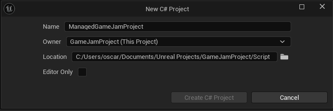

# Create New Plugin

Go to the **Plugins** window by following the steps in the image below:

<figure><figcaption></figcaption></figure>

Now click on **Add** as seen in the image below:

<figure><figcaption></figcaption></figure>

This will open up the plugin wizard where there are a bunch of templates, **C# Only** and **C++/C# Joint** being two of them.&#x20;

<figure><figcaption></figcaption></figure>

Choose C# plugin template, choose plugin name and press **Create Plugin**.
