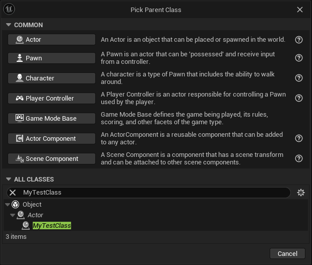

# Your First Script

```csharp
using UnrealSharp.Attributes;
using UnrealSharp.Engine;

namespace ManagedTestCSharp;

[UClass]
public partial class AMyTestClass : AActor
{   
    // Automatically instantiated as a component, attached to the root, and editable in the defaults
    [UProperty(DefaultComponent = true, RootComponent = true)]
    public partial UStaticMeshComponent MyStaticMeshComponent { get; set; }
    
    // Can be read from Blueprints, but only set from C#
    [UProperty(PropertyFlags.BlueprintReadOnly)]
    public partial int MyInt { get; set; }
    
    // Can be read and set from Blueprints
    [UProperty(PropertyFlags.BlueprintReadWrite)]
    public partial IList<int> MyList { get; set; }
    
    // Can be read and set from Blueprints, but only editable in the defaults, not per instance
    [UProperty(PropertyFlags.BlueprintReadWrite | PropertyFlags.EditDefaultsOnly)]
    public partial bool MyBool { get; set; }

    public override void BeginPlay()
    {
        PrintString("Hello from C#!");
        base.BeginPlay();
    }

    [UFunction(FunctionFlags.BlueprintCallable)]
    public void MyFunction(int myInt)
    {
        MyInt = myInt;
        PrintString($"MyInt set to {MyInt}");
    }
    
    [UFunction(FunctionFlags.BlueprintCallable)]
    public bool TraceSingleFromPlayerView(APlayerController playerController, float traceDistance, ETraceChannel traceChannel, out FHitResult hitResult)
    {
        APlayerCameraManager cameraManager = playerController.PlayerCameraManager;
        APawn pawn = playerController.ControlledPawn;
    
        FVector cameraLoc = cameraManager.CameraLocation;
        FVector cameraDir = cameraManager.CameraRotation.ToVector;
        
        double cameraToPawnDist = FVector.Distance(cameraLoc, pawn.ActorLocation);
        double totalDistance = cameraToPawnDist + traceDistance;

        FVector start = cameraLoc;
        FVector end = start + cameraDir * totalDistance;
    
        IList<AActor> ignoreActors = new List<AActor> { pawn };
        return SystemLibrary.LineTraceByChannel(start, end, traceChannel.ToTraceQuery(), false, ignoreActors, EDrawDebugTrace.None, out hitResult, true);
    }
}
```

Return to the Unreal Engine editor, and your project will automatically compile the new code, and your class will be ready to use.

<figure><figcaption></figcaption></figure>

Now these members can be called from Blueprints!

<figure><figcaption></figcaption></figure>
