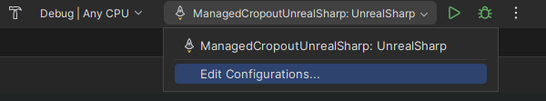
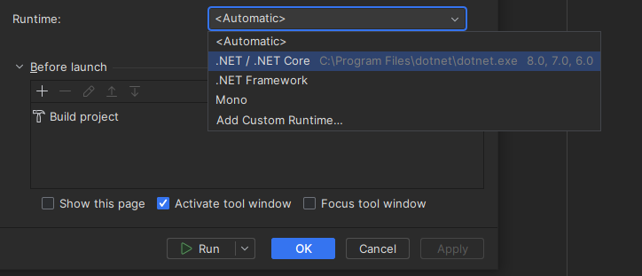

# Debugging

Once you have setup your project you can start the project through the C# project by pressing F5, and you will attach a debugger to the Unreal Engine instance, and you can start debugging.

### Rider Steps 

If you’re using Rider, you need to do an additional step to be able to debug.

Click on the run configurations up in the right corner:

<figure><figcaption></figcaption></figure>

And then choose **.NET / .NET Core** on the **Runtime** setting.

<figure><figcaption></figcaption></figure>

Hit **Apply** and **OK**. Now you can press F5 and start scripting! 😃
