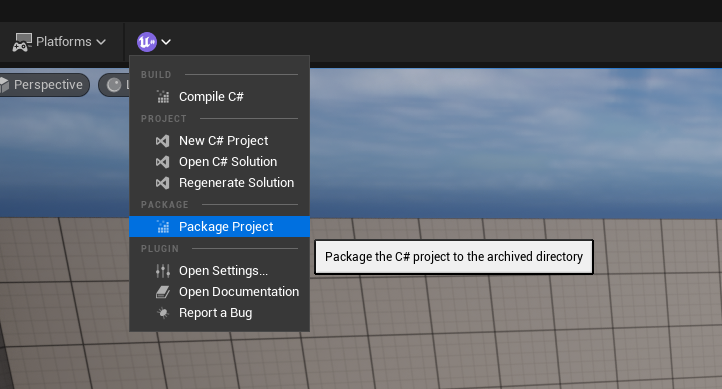
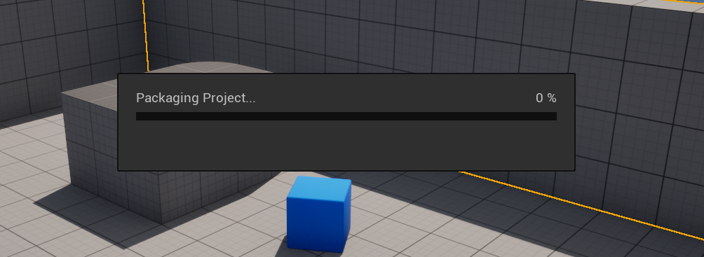

# Packaging


#### _**Currently only Windows/Mac is supported**_


Begin by packaging your game as you would normally in Unreal Engine. Ensure you select the correct platform (Windows) and configurations for your game. This initial step does not differ from the standard game packaging procedure in Unreal Engine.

There are two ways to package UnrealSharp, you can either package it via the editor or the command prompt. Both options are explained below.

## Packaging via Unreal Editor <a href="#packaging-via-unreal-editor" id="packaging-via-unreal-editor"></a>

You can easily package your C# project and runtime directly through the Unreal Editor. Follow these steps:

### Open the Packaging Tool <a href="#open-the-packaging-tool" id="open-the-packaging-tool"></a>

In the editor, navigate to the **UnrealSharp** toolbar located at the top of the viewport, and click on **Package Project**.

<figure><figcaption></figcaption></figure>

A file explorer dialog will appear, prompting you to choose the directory where your project will be packaged. Select the **root folder** of your packaged project. This is the folder containing your **.exe** file.

After selecting the correct folder, you should see the packaging process start.

<figure><figcaption></figcaption></figure>

Once the prompt disappears, the packaging is complete, and your game is ready to be launched.

## Packaging via Command Prompt <a href="#packaging-via-command-prompt" id="packaging-via-command-prompt"></a>

Open **Command Prompt** or **PowerShell** window and navigate to `UnrealSharp\Binaries\Managed`

### Package Project Script <a href="#package-project-script" id="package-project-script"></a>


```batch
dotnet UnrealSharpBuildTool.dll --Action PackageProject --ProjectDirectory "<YourProjectDirectory>" --ProjectName "<YourProjectName>" --PluginDirectory "<YourPluginDirectory>" --AdditionalArgs BuildConfig=Release ArchiveDirectory="<YourArchiveDirectory>"
```


**–Action:** The action you want UnrealSharpBuildTool to run.

**–ProjectDirectory:** The path to your project root directory (where .uproject resides).

**–ProjectName:** The name of your Unreal Engine project

**–PluginDirectory:** The path to the directory where the UnrealSharp plugin is installed within your project or engine.

**–ArchiveDirectory:** The root directory for where the packaged game is archived.

### Example Usage: <a href="#example-usage" id="example-usage"></a>

If your project is named “MyGame” and is located at `C:/Users/CoolName/Documents/Unreal Projects/MyGame`, with the UnrealSharp plugin in the project’s “Plugins” folder and you want to archive the packaged game to the desktop, your command would look like this:


```batch
dotnet UnrealSharpBuildTool.dll --Action PackageProject --ProjectDirectory "C:/Users/CoolName/Documents/Unreal Projects/MyGame/" --ProjectName "MyGame" --PluginDirectory "C:/Users/CoolName/Documents/Unreal Projects/MyGame/Plugins/UnrealSharp" --AdditionalArgs BuildConfig=Release ArchiveDirectory="C:/Users/CoolName/Desktop/Windows"
```


## Done and dusted! <a href="#done-and-dusted" id="done-and-dusted"></a>

Now the `MyProjectName\Binaries\Managed` folder in your packaged game should be populated and the game is ready to run.
