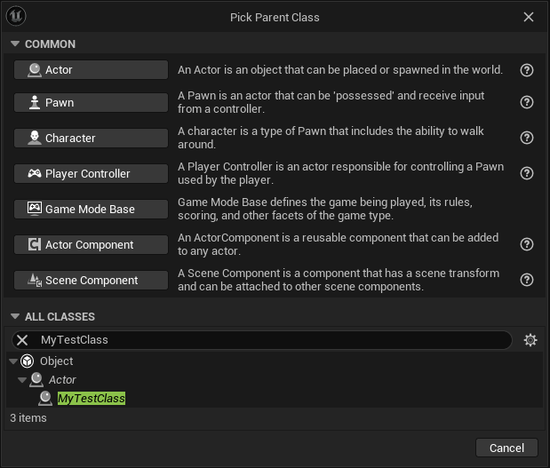

# Your First Script

## First Script

Example setup of a basic UnrealSharp class

```csharp
using UnrealSharp.Attributes;
using UnrealSharp.Engine;

namespace ManagedTestCSharp;

[UClass]
public class AMyTestClass : AActor
{   
    [UProperty(PropertyFlags.BlueprintReadOnly)]
    public int MyInt { get; set; }

    protected override void BeginPlay()
    {
        PrintString("Hello from C#!");
        base.BeginPlay();
    }

    [UFunction(FunctionFlags.BlueprintCallable)]
    public void MyFunction(bool myBool, int MyInt)
    {
        PrintString("Hello from MyFunction!");
    }
}
```

Now go back to Unreal Engine and it should compile your code and your class should be able to be found in the editor.

<figure><figcaption></figcaption></figure>

## &#x20;<a href="#debugging" id="debugging"></a>
